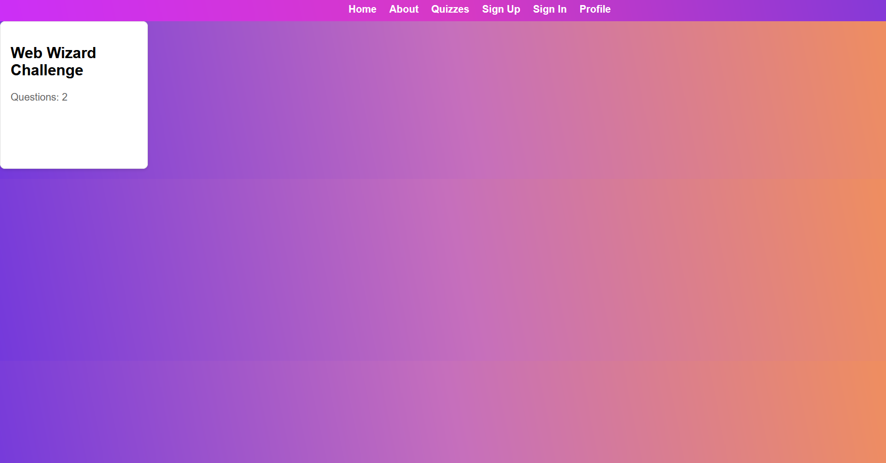
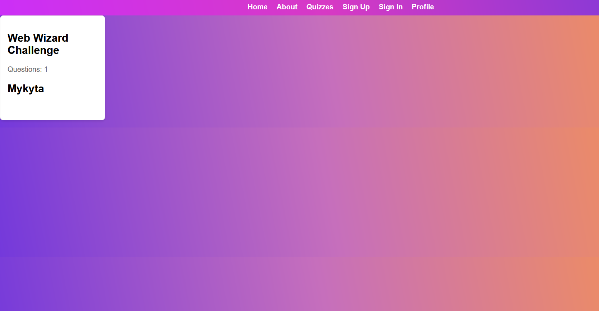

# Getting Started with Create React App

This project was bootstrapped with [Create React App](https://github.com/facebook/create-react-app).

## Getting Started

## Available Scripts

In the project directory, you can run:

To start the project, follow these steps:
```bash
clone this repository
```
open 2 console

first console
```bash
cd frontend
npm install
npm start
```

second console
```bash
cd backend
npm install
npm start
```

Runs the app in the development mode.\
Open [http://localhost:3000](http://localhost:3000) to view it in your browser.

---
### Main functional
* home page
* nav bar
* sign up, and sign in
* profile, for creating and displaying own data
* perform quizzes, checking own results

---
### Folder and file architecture
    quiz-react/
    |-- backend/
    |   |-- controllers/
    |   |   |-- Controllerfiles.js
    |   |
    |   |-- config.js 
    |   |
    |   |-- server.js
    |   |-- package.json
    |
    |
    |-- frontend/
    |   |-- public/
    |   |
    |   |-- src/
    |   |   |-- auth/
    |   |   |   |-- files
    |   |   |   
    |   |   |-- css/
    |   |   |   |-- files for styles
    |   |   |
    |   |   |-- profile/
    |   |   |   |-- files for profile
    |   |   |   
    |   |   |-- quiz/
    |   |   |   |-- files for quizzes 
    |   |   |
    |   |   |-- App.js
    |   |   |-- home.js
    |   |   |-- index.js
    |   |   |
    |   | 
    |   |
    |   |-- package.json
    |   |
    |
    |-- .gitignore
    |-- package.json
    |-- README


#### Backend 
**For start backend, before that run the frontend**
```cd backend```
```npm run dev```

**Technologies** 
- framework -- express.js
- database -- sqlite
- logger -- winston
- encryption -- bcrypt

**Folder Structure**

**Controllers:** Contains controllers that handle the logic for the backend routes. 

**config:** creating logger, database, sql (create tables, and init database) 

**server:** routes, init database, listend port

#### Frontend
**Technologies**
- asynchrony - axios
- framework - express
- animation - framer-motion
- react
- routers - react-dom, react-router-dom

**Folder Structure**

**src:** Contains the source code of the React app
**Files in src**
-- **auth:** files that concern authorization
-- **css:** styles
-- **profile:** files related to the user profile and what is in it
-- **quiz:** everything related to the display, or the logic of passing the quiz


#### Demo






